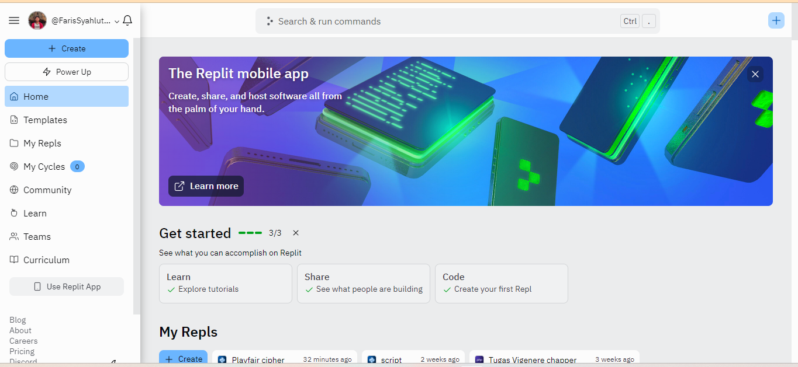
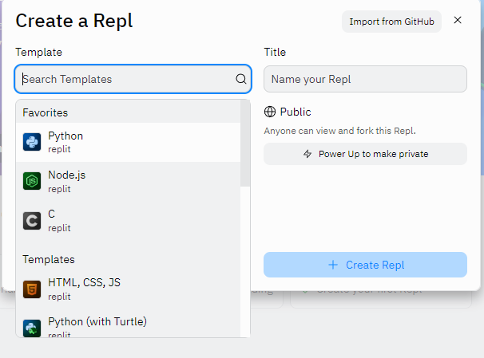

# Kriptografi_Playfaircipher

| Nama      | Faris Syahluthfi |
| ----------- | ----------- |
| NIM     | 312010034       |
| Kelas   | TI.20.A.1        |

## Membuat program Playfair cipher
# PROGRAM program Playfair cipher
Berikut langkah-langkah membuat program playfair cipher menggunakan bahasa pemrograman python:

## Membuat program di replit
Saya membuat program ini dengan website replit. Kalian bisa buka replinya di: https://replit.com.

Setalah kalian klik link replitnya maka kalian akan di halaman utama.

# Halaman utama replit 

## Membuat file baru direplit 

1. Pilih menu "CREATE" pada halaman replit. 

2. Ditampilan template fungsinya untuk memilih bahasa pemrograman untuk membuat filenya. Disini kita membuat programnya menggunakan bahasa pemrograman python, jadi kalian pilih yang python. 

