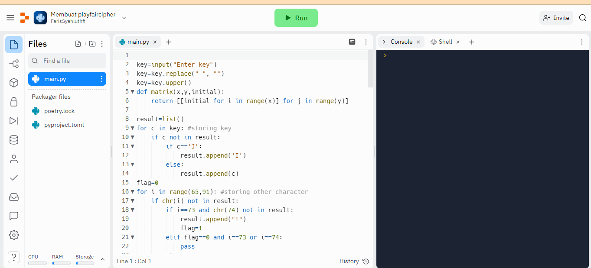
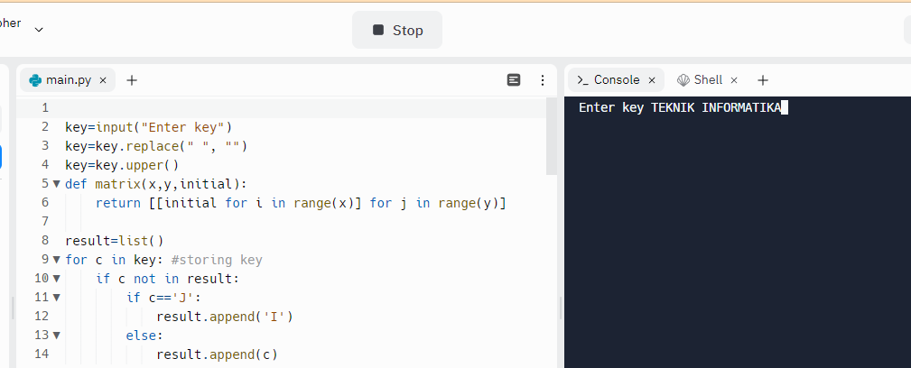
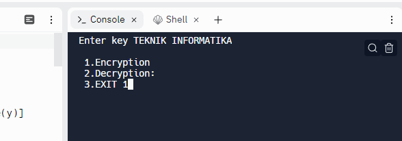

# Kriptografi_Playfaircipher


| Nama      | Faris Syahluthfi |
| ----------- | ----------- |
| NIM     | 312010034       |
| Kelas   | TI.20.A.1        |

## Membuat program Playfair cipher
# PROGRAM program Playfair cipher
Berikut langkah-langkah membuat program playfair cipher menggunakan bahasa pemrograman python:</p>
## Membuat program di replit
Saya membuat program ini dengan website replit. Kalian bisa buka replinya di: https://replit.com.</p>
Setalah kalian klik link replitnya maka kalian akan di halaman utama.</p>
# Halaman utama replit </p>


## Membuat file baru direplit </p>
1. Pilih menu "CREATE" pada halaman replit. </p>


2. Ditampilan template fungsinya untuk memilih bahasa pemrograman untuk membuat filenya. Disini kita membuat programnya menggunakan bahasa pemrograman python, jadi kalian pilih yang python. </p>
</p>
Jangan lupa kita kasih nama filenya, disini kita kasih nama filenya "Membuat playfaircipher". Selanjutnya kita pilih "Create Repl". </p>
</p>

3. Selanjutnya kalian bisa mengisi/mengetik codingannya:
```python

key=input("Enter key")
key=key.replace(" ", "")
key=key.upper()
def matrix(x,y,initial):
    return [[initial for i in range(x)] for j in range(y)]
    
result=list()
for c in key: #storing key
    if c not in result:
        if c=='J':
            result.append('I')
        else:
            result.append(c)
flag=0
for i in range(65,91): #storing other character
    if chr(i) not in result:
        if i==73 and chr(74) not in result:
            result.append("I")
            flag=1
        elif flag==0 and i==73 or i==74:
            pass    
        else:
            result.append(chr(i))
k=0
my_matrix=matrix(5,5,0) #initialize matrix
for i in range(0,5): #making matrix
    for j in range(0,5):
        my_matrix[i][j]=result[k]
        k+=1

def locindex(c): #get location of each character
    loc=list()
    if c=='J':
        c='I'
    for i ,j in enumerate(my_matrix):
        for k,l in enumerate(j):
            if c==l:
                loc.append(i)
                loc.append(k)
                return loc
            
def encrypt():  #Encryption
    msg=str(input("ENTER MSG:"))
    msg=msg.upper()
    msg=msg.replace(" ", "")             
    i=0
    for s in range(0,len(msg)+1,2):
        if s<len(msg)-1:
            if msg[s]==msg[s+1]:
                msg=msg[:s+1]+'X'+msg[s+1:]
    if len(msg)%2!=0:
        msg=msg[:]+'X'
    print("CIPHER TEXT:",end=' ')
    while i<len(msg):
        loc=list()
        loc=locindex(msg[i])
        loc1=list()
        loc1=locindex(msg[i+1])
        if loc[1]==loc1[1]:
            print("{}{}".format(my_matrix[(loc[0]+1)%5][loc[1]],my_matrix[(loc1[0]+1)%5][loc1[1]]),end=' ')
        elif loc[0]==loc1[0]:
            print("{}{}".format(my_matrix[loc[0]][(loc[1]+1)%5],my_matrix[loc1[0]][(loc1[1]+1)%5]),end=' ')  
        else:
            print("{}{}".format(my_matrix[loc[0]][loc1[1]],my_matrix[loc1[0]][loc[1]]),end=' ')    
        i=i+2        
                 
def decrypt():  #decryption
    msg=str(input("ENTER CIPHER TEXT:"))
    msg=msg.upper()
    msg=msg.replace(" ", "")
    print("PLAIN TEXT:",end=' ')
    i=0
    while i<len(msg):
        loc=list()
        loc=locindex(msg[i])
        loc1=list()
        loc1=locindex(msg[i+1])
        if loc[1]==loc1[1]:
            print("{}{}".format(my_matrix[(loc[0]-1)%5][loc[1]],my_matrix[(loc1[0]-1)%5][loc1[1]]),end=' ')
        elif loc[0]==loc1[0]:
            print("{}{}".format(my_matrix[loc[0]][(loc[1]-1)%5],my_matrix[loc1[0]][(loc1[1]-1)%5]),end=' ')  
        else:
            print("{}{}".format(my_matrix[loc[0]][loc1[1]],my_matrix[loc1[0]][loc[1]]),end=' ')    
        i=i+2        

while(1):
    choice=int(input("\n 1.Encryption \n 2.Decryption: \n 3.EXIT"))
    if choice==1:
        encrypt()
    elif choice==2:
        decrypt()
    elif choice==3:
        exit()
    else:
        print("Choose correct choice")

```
</p>

</p>

4. Selanjutnya kalian pilih "Run" untuk menampilkan output programnya. Setelah di "Run" akan muncul output: "ENTER KEY", Maksud dari ENTER KEY yaitu kata kuncinya. Disini saya menggunakan kata kunci "TEKNIK INFORMATIKA", tetapi itu terserah kalian mau menggunakan kata kunci lain. Setelah menginputkan kata kunci lalu kalian klik enter pada keyboard kalian.</p>
</p>

5. Setelah kalian klik enter maka akan muncul outputnya: </p>
 1.Encryption </p>
 2.Descryption </p>
 3.EXIT </p>
 Terdapat 3 menu pada outputnya. Kalian pilih menunya sesuai dengan kebutuhan. Disini saya akan menginputkan Encryption jadi saya pilih menu "1. Encryption".</p>
 Kalian cukup mengetikan nomernya saja, Contoh "1". Setelah itu kalian klik tombol pada keyboard kalian. </p>
 </p>
